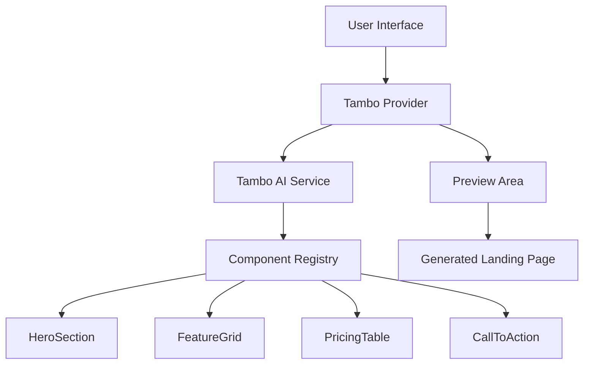

# Design Document: Conversational Product Designer with Tambo AI

## Overview

The Conversational Product Designer is a Next.js application that leverages Tambo AI's generative UI capabilities to create landing pages from natural language prompts. The system uses a component registry approach where four predefined React components (HeroSection, FeatureGrid, PricingTable, CallToAction) are registered with Tambo AI, which then composes them based on user input.

The application follows a client-side architecture with no backend persistence, focusing on real-time UI generation and preview capabilities. The design emphasizes type safety through TypeScript and Zod schemas, professional styling with Tailwind CSS, and a polished user experience suitable for demonstrations.

## Architecture

### High-Level Architecture



### Technology Stack

- **Frontend Framework**: Next.js 14+ with App Router
- **Language**: TypeScript for type safety
- **Styling**: Tailwind CSS for responsive design
- **AI Integration**: Tambo AI React SDK (@tambo-ai/react)
- **Validation**: Zod for schema validation
- **State Management**: React hooks and Tambo's built-in state management

### Project Structure

```
src/
├── app/
│   ├── layout.tsx          # Root layout with providers
│   ├── page.tsx            # Main application page (may inline UI components for MVP)
│   └── globals.css         # Global styles and Tailwind imports
├── components/
│   ├── landing/            # Landing page components
│   │   ├── HeroSection.tsx
│   │   ├── FeatureGrid.tsx
│   │   ├── PricingTable.tsx
│   │   └── CallToAction.tsx
│   ├── ui/                 # Interface components (may be inlined in page.tsx)
│   │   ├── PromptInput.tsx
│   │   ├── GenerateButton.tsx
│   │   ├── PreviewArea.tsx
│   │   └── ExportButton.tsx
│   └── providers/
│       └── TamboProvider.tsx
├── lib/
│   ├── schemas.ts          # Zod schemas for components
│   ├── tambo-config.ts     # Tambo configuration
│   └── utils.ts            # Utility functions
└── types/
    └── index.ts            # TypeScript type definitions
```

**Note**: During implementation, some UI components may be inlined into page.tsx to reduce complexity while preserving architectural intent.

## Components and Interfaces

### Landing Page Components

#### HeroSection Component
```typescript
interface HeroSectionProps {
  headline: string;
  subheadline: string;
  ctaText: string;
  ctaLink?: string;
  backgroundImage?: string;
}
```

The HeroSection serves as the primary focal point of landing pages, featuring a large headline, supporting subheadline, and prominent call-to-action button. The component uses responsive typography and supports optional background imagery.

#### FeatureGrid Component
```typescript
interface Feature {
  title: string;
  description: string;
  icon?: string;
}

interface FeatureGridProps {
  title?: string;
  features: Feature[];
  columns?: 2 | 3 | 4;
}
```

The FeatureGrid displays multiple features in a responsive grid layout. It supports 2-4 columns and includes optional icons for each feature. The grid automatically adapts to different screen sizes.

#### PricingTable Component
```typescript
interface PricingTier {
  name: string;
  price: string;
  period?: string;
  features: string[];
  highlighted?: boolean;
  ctaText?: string;
}

interface PricingTableProps {
  title?: string;
  tiers: PricingTier[];
}
```

The PricingTable component displays pricing information in a clean, comparative format. It supports tier highlighting and customizable call-to-action buttons for each pricing option.

#### CallToAction Component
```typescript
interface CallToActionProps {
  headline: string;
  description?: string;
  primaryButton: {
    text: string;
    link?: string;
  };
  secondaryButton?: {
    text: string;
    link?: string;
  };
  backgroundColor?: 'primary' | 'secondary' | 'accent';
}
```

The CallToAction component provides a focused conversion point with primary and optional secondary actions. It supports different background color themes and responsive button layouts.

### User Interface Components

#### PromptInput Component
```typescript
interface PromptInputProps {
  value: string;
  onChange: (value: string) => void;
  onSubmit: () => void;
  isLoading: boolean;
  placeholder?: string;
}
```

A textarea-based input component with submit functionality, loading states, and helpful placeholder text to guide users in writing effective prompts.

#### PreviewArea Component
```typescript
interface PreviewAreaProps {
  children: React.ReactNode;
  isLoading: boolean;
  error?: string;
}
```

A container component that displays generated landing pages with loading states and error handling. Provides visual separation from the input interface.

### Tambo Integration Layer

#### Component Registry Configuration
```typescript
const componentRegistry: TamboComponent[] = [
  {
    name: "HeroSection",
    description: "Primary landing page hero with headline, subheadline, and CTA",
    component: HeroSection,
    propsSchema: heroSectionSchema,
  },
  {
    name: "FeatureGrid", 
    description: "Grid layout displaying multiple features with icons and descriptions",
    component: FeatureGrid,
    propsSchema: featureGridSchema,
  },
  {
    name: "PricingTable",
    description: "Comparative pricing display with multiple tiers and features",
    component: PricingTable,
    propsSchema: pricingTableSchema,
  },
  {
    name: "CallToAction",
    description: "Conversion-focused section with primary and secondary actions",
    component: CallToAction,
    propsSchema: callToActionSchema,
  },
];
```

## Data Models

### Zod Schemas

The application uses Zod schemas for runtime type validation and integration with Tambo AI:

```typescript
// Hero Section Schema
export const heroSectionSchema = z.object({
  headline: z.string().min(1, "Headline is required"),
  subheadline: z.string().min(1, "Subheadline is required"),
  ctaText: z.string().min(1, "CTA text is required"),
  ctaLink: z.string().optional(), // Relaxed validation for AI compatibility
  backgroundImage: z.string().optional(), // Relaxed validation for AI compatibility
});

// Feature Schema
export const featureSchema = z.object({
  title: z.string().min(1, "Feature title is required"),
  description: z.string().min(1, "Feature description is required"),
  icon: z.string().optional(), // Relaxed validation for AI compatibility
});

// Feature Grid Schema
export const featureGridSchema = z.object({
  title: z.string().optional(),
  features: z.array(featureSchema).min(1, "At least one feature is required"),
  columns: z.enum(["2", "3", "4"]).optional().default("3"),
});

// Pricing Tier Schema
export const pricingTierSchema = z.object({
  name: z.string().min(1, "Tier name is required"),
  price: z.string().min(1, "Price is required"),
  period: z.string().optional(),
  features: z.array(z.string()).min(1, "At least one feature is required"),
  highlighted: z.boolean().optional().default(false),
  ctaText: z.string().optional().default("Get Started"),
});

// Pricing Table Schema
export const pricingTableSchema = z.object({
  title: z.string().optional(),
  tiers: z.array(pricingTierSchema).min(1, "At least one tier is required"),
});

// Call to Action Schema
export const callToActionSchema = z.object({
  headline: z.string().min(1, "Headline is required"),
  description: z.string().optional(),
  primaryButton: z.object({
    text: z.string().min(1, "Button text is required"),
    link: z.string().optional(), // Relaxed validation for AI compatibility
  }),
  secondaryButton: z.object({
    text: z.string().min(1, "Button text is required"),
    link: z.string().optional(), // Relaxed validation for AI compatibility
  }).optional(),
  backgroundColor: z.enum(["primary", "secondary", "accent"]).optional().default("primary"),
});
```

**Note**: Schema validation has been relaxed for AI compatibility. Strict URL validation can cause AI failures, and optional fields like icons and background images may be hallucinated by the AI.

### System Prompt Configuration

The Tambo provider uses a carefully crafted system prompt to ensure consistent behavior:

```typescript
const SYSTEM_PROMPT = `You are a UI composer for landing pages. You have access to exactly four components:

1. HeroSection - Use for primary landing page headers with headlines and CTAs
2. FeatureGrid - Use for displaying multiple features in a grid layout  
3. PricingTable - Use for showing pricing tiers and comparisons
4. CallToAction - Use for conversion-focused sections

IMPORTANT RULES:
- Only use these four registered components
- Do not invent or suggest other components
- Prefer fewer components unless the user specifically asks for more
- Do not repeat the same component type more than once unless explicitly requested
- Always provide realistic, professional content
- Ensure all required props are included
- Use appropriate component combinations for complete landing pages
- For MVP and demo purposes, optional props may be ignored unless explicitly requested

When composing landing pages:
- Start with HeroSection for most pages
- Use FeatureGrid to highlight key benefits
- Include PricingTable when pricing is relevant
- End with CallToAction for conversion focus`;
```

## Correctness Properties

*A property is a characteristic or behavior that should hold true across all valid executions of a system—essentially, a formal statement about what the system should do. Properties serve as the bridge between human-readable specifications and machine-verifiable correctness guarantees.*

**Note**: These properties represent design-time correctness goals. Not all properties are enforced via automated tests in the MVP.

Based on the prework analysis, the following properties ensure the system behaves correctly across all valid inputs:

### Property 1: Schema Validation Consistency
*For any* component props object, if it passes the corresponding Zod schema validation, then the component should render without throwing validation errors.
**Validates: Requirements 2.2, 10.2**

### Property 2: Component Rendering Completeness  
*For any* valid props passed to HeroSection, the rendered output should contain headline, subheadline, and CTA elements.
**Validates: Requirements 3.1**

### Property 3: Feature Grid Layout Integrity
*For any* valid FeatureGrid props with N features, the rendered component should display exactly N feature items in a grid layout.
**Validates: Requirements 3.2**

### Property 4: Pricing Table Data Preservation
*For any* valid PricingTable props with M tiers, the rendered component should display exactly M pricing tiers with all provided features.
**Validates: Requirements 3.3**

### Property 5: Call-to-Action Button Presence
*For any* valid CallToAction props, the rendered component should contain at least one action button with the specified text.
**Validates: Requirements 3.4**

### Property 6: Prompt Processing Consistency
*For any* non-empty string prompt, triggering the generate function should result in a call to the Tambo AI service with that prompt.
**Validates: Requirements 4.2**

### Property 7: Loading State Management
*For any* async generation operation, the loading state should be true during execution and false upon completion or error.
**Validates: Requirements 4.3**

### Property 8: Error Handling Robustness
*For any* failed generation request, the system should display an appropriate error message without crashing.
**Validates: Requirements 4.4**

### Property 9: Preview Rendering Fidelity
*For any* valid component composition returned by Tambo AI, the preview area should successfully render the components.
**Validates: Requirements 5.1**

### Property 10: State Persistence During Operations
*For any* existing preview content, starting a new generation should not immediately clear the previous preview until the new one is ready.
**Validates: Requirements 5.3**

### Property 11: Export Button Interaction
*For any* click event on the export button, a tooltip should be displayed indicating the feature is not yet available.
**Validates: Requirements 7.2**

### Property 12: Tooltip Presence for Interactive Elements
*For any* interactive UI element, hovering or focusing should display helpful guidance or status information.
**Validates: Requirements 8.3**

### Property 13: Response Schema Validation
*For any* response from Tambo AI, the system should validate it against expected component schemas before rendering.
**Validates: Requirements 10.3**

### Property 14: Type Error Recovery
*For any* type validation error during component rendering, the system should handle it gracefully without crashing the application.
**Validates: Requirements 10.4**

## Error Handling

**Note**: In the MVP, error handling focuses on graceful user feedback and retry capability; advanced recovery strategies are future enhancements.

### Client-Side Error Boundaries

The application implements React Error Boundaries to catch and handle component rendering errors gracefully:

```typescript
interface ErrorBoundaryState {
  hasError: boolean;
  error?: Error;
}

class ComponentErrorBoundary extends React.Component<
  React.PropsWithChildren<{}>,
  ErrorBoundaryState
> {
  // Error boundary implementation for component failures
}
```

### Tambo AI Integration Errors

Error handling for Tambo AI service interactions includes:

- **Network Errors**: Display user-friendly messages for connectivity issues
- **API Rate Limits**: Implement retry logic with exponential backoff
- **Invalid Responses**: Validate responses against schemas and show appropriate errors
- **Timeout Handling**: Set reasonable timeouts and provide feedback for long operations

### Schema Validation Errors

Zod schema validation errors are handled at multiple levels:

- **Component Props**: Validate props before rendering and show development warnings
- **API Responses**: Validate Tambo responses and handle malformed data gracefully
- **User Input**: Validate form inputs and provide immediate feedback

### Graceful Degradation

The system implements graceful degradation strategies:

- **Component Fallbacks**: Show placeholder content when components fail to render
- **Partial Rendering**: Display successfully rendered components even if others fail
- **Error Recovery**: Allow users to retry failed operations without losing context

## Testing Strategy

### Dual Testing Approach

The application uses both unit tests and property-based tests for comprehensive coverage:

**Unit Tests** focus on:
- Specific component rendering scenarios
- Error boundary behavior
- User interaction flows
- Integration points between components

**Property-Based Tests** focus on:
- Universal properties that hold for all inputs
- Schema validation across all possible prop combinations
- Component behavior consistency
- Error handling robustness

### Property-Based Testing Configuration

**Note**: Property-based tests are included as an advanced validation strategy and may be partially implemented in the MVP.

The system uses **fast-check** for JavaScript/TypeScript property-based testing:

- **Minimum 100 iterations** per property test to ensure thorough coverage
- **Custom generators** for component props based on Zod schemas
- **Shrinking support** to find minimal failing examples
- **Tagged tests** referencing design document properties

Each property test includes a comment tag in the format:
**Feature: conversational-product-designer, Property {number}: {property_text}**

### Test Organization

```typescript
// Example property test structure
describe('Component Rendering Properties', () => {
  test('Property 1: Schema Validation Consistency', () => {
    // Feature: conversational-product-designer, Property 1: Schema Validation Consistency
    fc.assert(fc.property(
      heroSectionPropsGenerator,
      (props) => {
        const validationResult = heroSectionSchema.safeParse(props);
        if (validationResult.success) {
          expect(() => render(<HeroSection {...props} />)).not.toThrow();
        }
      }
    ), { numRuns: 100 });
  });
});
```

### Integration Testing

Integration tests verify the complete user workflow:

1. **Prompt Input → Generation**: Test the full flow from user input to component rendering
2. **Error Recovery**: Verify error handling and recovery mechanisms
3. **State Management**: Test state persistence and updates across operations
4. **Component Composition**: Verify multiple components render correctly together

### Testing Tools and Libraries

- **Jest**: Primary testing framework
- **React Testing Library**: Component testing utilities
- **fast-check**: Property-based testing library
- **MSW (Mock Service Worker)**: API mocking for Tambo AI integration
- **@testing-library/user-event**: User interaction simulation

The testing strategy ensures both specific examples work correctly (unit tests) and universal properties hold across all inputs (property tests), providing comprehensive validation of system correctness.