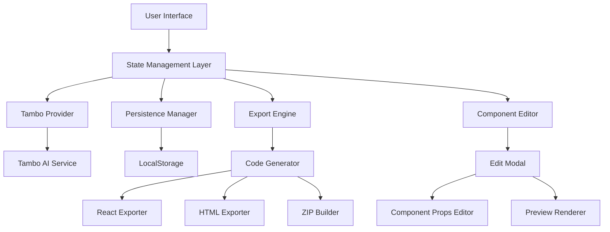

# Design Document: Hackathon Improvements

## Overview

This design document outlines the architecture and implementation strategy for transforming the Conversational Product Designer from a basic demo into a hackathon-winning application. The improvements focus on three critical areas: code export functionality, component-level editing, and persistence layer.

These features address the core weaknesses identified in the critique: lack of usability (no export), inability to iterate (no editing), and impracticality (no persistence). Together, they transform the application from a one-shot demo into a professional tool.

## Architecture

### High-Level Architecture



### Technology Stack Additions

- **JSZip**: For creating downloadable ZIP files with exported code
- **Prettier**: For formatting exported code
- **React DnD**: For drag-and-drop component reordering
- **Zustand**: Lightweight state management for complex interactions

### Updated Project Structure

```
src/
├── app/
│   ├── layout.tsx
│   ├── page.tsx
│   └── globals.css
├── components/
│   ├── landing/              # 19 existing components
│   ├── editor/               # NEW: Editing components
│   │   ├── ComponentEditor.tsx
│   │   ├── EditModal.tsx
│   │   ├── PropsEditor.tsx
│   │   └── ComponentWrapper.tsx
│   ├── export/               # NEW: Export components
│   │   ├── ExportModal.tsx
│   │   ├── FormatSelector.tsx
│   │   └── DownloadButton.tsx
│   ├── projects/             # NEW: Project management
│   │   ├── ProjectsSidebar.tsx
│   │   ├── ProjectCard.tsx
│   │   └── ProjectManager.tsx
│   └── providers/
│       └── TamboProvider.tsx
├── lib/
│   ├── schemas.ts
│   ├── tambo-config.ts
│   ├── prompt-enhancer.ts
│   ├── export/               # NEW: Export utilities
│   │   ├── react-exporter.ts
│   │   ├── html-exporter.ts
│   │   ├── code-formatter.ts
│   │   └── zip-builder.ts
│   ├── persistence/          # NEW: Persistence utilities
│   │   ├── storage.ts
│   │   ├── project-manager.ts
│   │   └── types.ts
│   └── utils.ts
├── store/                    # NEW: State management
│   ├── useDesignStore.ts
│   ├── useProjectStore.ts
│   └── useEditorStore.ts
└── types/
    └── index.ts
```

## Phase 1: Core Functionality

### 1. Code Export System

#### Architecture

The export system consists of three main components:

1. **Code Generator**: Converts component tree to code
2. **Format Handlers**: React and HTML exporters
3. **ZIP Builder**: Packages files for download

#### Component Interfaces

```typescript
// Export Configuration
interface ExportConfig {
  format: 'react' | 'html';
  includeComments: boolean;
  includeTailwind: boolean;
  includeReadme: boolean;
  projectName: string;
}

// Export Result
interface ExportResult {
  files: ExportFile[];
  metadata: {
    componentCount: number;
    totalLines: number;
    dependencies: string[];
  };
}

interface ExportFile {
  path: string;
  content: string;
  type: 'component' | 'style' | 'config' | 'readme';
}
```

#### React Exporter Implementation

```typescript
class ReactExporter {
  export(components: ComponentInstance[], config: ExportConfig): ExportResult {
    const files: ExportFile[] = [];
    
    // Generate individual component files
    components.forEach((comp, index) => {
      files.push({
        path: `components/${comp.name}${index}.tsx`,
        content: this.generateComponentCode(comp),
        type: 'component'
      });
    });
    
    // Generate main page file
    files.push({
      path: 'page.tsx',
      content: this.generatePageCode(components),
      type: 'component'
    });
    
    // Generate package.json
    files.push({
      path: 'package.json',
      content: this.generatePackageJson(components),
      type: 'config'
    });
    
    // Generate README
    if (config.includeReadme) {
      files.push({
        path: 'README.md',
        content: this.generateReadme(components),
        type: 'readme'
      });
    }
    
    return { files, metadata: this.calculateMetadata(files) };
  }
  
  private generateComponentCode(comp: ComponentInstance): string {
    // Convert component instance to TypeScript code
    const imports = this.generateImports(comp);
    const props = this.generatePropsInterface(comp);
    const component = this.generateComponentFunction(comp);
    
    return `${imports}\n\n${props}\n\n${component}`;
  }
}
```

#### HTML Exporter Implementation

```typescript
class HTMLExporter {
  export(components: ComponentInstance[], config: ExportConfig): ExportResult {
    const files: ExportFile[] = [];
    
    // Generate single HTML file
    files.push({
      path: 'index.html',
      content: this.generateHTML(components, config),
      type: 'component'
    });
    
    // Generate inline CSS
    if (config.includeTailwind) {
      files.push({
        path: 'styles.css',
        content: this.generateTailwindCSS(),
        type: 'style'
      });
    }
    
    return { files, metadata: this.calculateMetadata(files) };
  }
  
  private generateHTML(components: ComponentInstance[], config: ExportConfig): string {
    const head = this.generateHead(config);
    const body = components.map(c => this.componentToHTML(c)).join('\n');
    
    return `<!DOCTYPE html>
<html lang="en">
${head}
<body>
${body}
</body>
</html>`;
  }
}
```

#### ZIP Builder

```typescript
class ZIPBuilder {
  async build(files: ExportFile[], projectName: string): Promise<Blob> {
    const zip = new JSZip();
    const folder = zip.folder(projectName);
    
    files.forEach(file => {
      folder?.file(file.path, file.content);
    });
    
    return await zip.generateAsync({ type: 'blob' });
  }
  
  download(blob: Blob, filename: string): void {
    const url = URL.createObjectURL(blob);
    const link = document.createElement('a');
    link.href = url;
    link.download = filename;
    link.click();
    URL.revokeObjectURL(url);
  }
}
```

### 2. Component-Level Editing

#### Architecture

The editing system wraps each generated component with an interactive overlay that provides edit, delete, and reorder capabilities.

#### Component Wrapper

```typescript
interface ComponentWrapperProps {
  component: ComponentInstance;
  index: number;
  onEdit: (index: number) => void;
  onDelete: (index: number) => void;
  onMoveUp: (index: number) => void;
  onMoveDown: (index: number) => void;
}

function ComponentWrapper({ 
  component, 
  index, 
  onEdit, 
  onDelete, 
  onMoveUp, 
  onMoveDown 
}: ComponentWrapperProps) {
  const [isHovered, setIsHovered] = useState(false);
  
  return (
    <div 
      className="relative group"
      onMouseEnter={() => setIsHovered(true)}
      onMouseLeave={() => setIsHovered(false)}
    >
      {/* Component Content */}
      {component.renderedComponent}
      
      {/* Edit Overlay */}
      {isHovered && (
        <div className="absolute top-2 right-2 flex gap-2 bg-gray-900/90 rounded-lg p-2">
          <button onClick={() => onEdit(index)} className="...">
            Edit
          </button>
          <button onClick={() => onMoveUp(index)} className="...">
            ↑
          </button>
          <button onClick={() => onMoveDown(index)} className="...">
            ↓
          </button>
          <button onClick={() => onDelete(index)} className="...">
            Delete
          </button>
        </div>
      )}
    </div>
  );
}
```

#### Edit Modal

```typescript
interface EditModalProps {
  component: ComponentInstance;
  onSave: (updatedProps: any) => void;
  onCancel: () => void;
}

function EditModal({ component, onSave, onCancel }: EditModalProps) {
  const [props, setProps] = useState(component.props);
  const [preview, setPreview] = useState(component);
  
  const handleFieldChange = (field: string, value: any) => {
    const updated = { ...props, [field]: value };
    setProps(updated);
    setPreview({ ...component, props: updated });
  };
  
  return (
    <div className="fixed inset-0 bg-black/50 flex items-center justify-center z-50">
      <div className="bg-gray-800 rounded-xl max-w-6xl w-full max-h-[90vh] overflow-hidden flex">
        {/* Left: Editor */}
        <div className="w-1/2 p-6 overflow-y-auto">
          <h2 className="text-2xl font-bold text-white mb-4">
            Edit {component.name}
          </h2>
          
          <PropsEditor 
            schema={component.schema}
            props={props}
            onChange={handleFieldChange}
          />
          
          <div className="flex gap-4 mt-6">
            <button onClick={() => onSave(props)} className="...">
              Save Changes
            </button>
            <button onClick={onCancel} className="...">
              Cancel
            </button>
          </div>
        </div>
        
        {/* Right: Preview */}
        <div className="w-1/2 bg-white overflow-y-auto">
          <div className="p-4">
            <h3 className="text-sm font-semibold text-gray-600 mb-2">
              Live Preview
            </h3>
            {preview.renderedComponent}
          </div>
        </div>
      </div>
    </div>
  );
}
```

#### Props Editor

```typescript
interface PropsEditorProps {
  schema: z.ZodObject<any>;
  props: any;
  onChange: (field: string, value: any) => void;
}

function PropsEditor({ schema, props, onChange }: PropsEditorProps) {
  const fields = Object.keys(schema.shape);
  
  return (
    <div className="space-y-4">
      {fields.map(field => {
        const fieldSchema = schema.shape[field];
        const fieldType = getFieldType(fieldSchema);
        
        return (
          <div key={field}>
            <label className="block text-sm font-medium text-gray-300 mb-2">
              {formatFieldName(field)}
            </label>
            
            {fieldType === 'string' && (
              <input
                type="text"
                value={props[field] || ''}
                onChange={(e) => onChange(field, e.target.value)}
                className="w-full px-3 py-2 bg-gray-700 text-white rounded-lg"
              />
            )}
            
            {fieldType === 'textarea' && (
              <textarea
                value={props[field] || ''}
                onChange={(e) => onChange(field, e.target.value)}
                className="w-full px-3 py-2 bg-gray-700 text-white rounded-lg"
                rows={3}
              />
            )}
            
            {fieldType === 'select' && (
              <select
                value={props[field] || ''}
                onChange={(e) => onChange(field, e.target.value)}
                className="w-full px-3 py-2 bg-gray-700 text-white rounded-lg"
              >
                {getSelectOptions(fieldSchema).map(opt => (
                  <option key={opt} value={opt}>{opt}</option>
                ))}
              </select>
            )}
            
            {fieldType === 'array' && (
              <ArrayEditor
                value={props[field] || []}
                onChange={(value) => onChange(field, value)}
                itemSchema={fieldSchema._def.type}
              />
            )}
          </div>
        );
      })}
    </div>
  );
}
```

### 3. Persistence and Project Management

#### Storage Architecture

```typescript
// Project Data Model
interface Project {
  id: string;
  name: string;
  createdAt: number;
  updatedAt: number;
  prompt: string;
  components: ComponentInstance[];
  thumbnail?: string;
}

interface ComponentInstance {
  id: string;
  name: string;
  props: any;
  schema: z.ZodObject<any>;
  renderedComponent: React.ReactNode;
}

// Storage Manager
class StorageManager {
  private readonly STORAGE_KEY = 'tambo_projects';
  private readonly MAX_PROJECTS = 10;
  
  saveProject(project: Project): void {
    const projects = this.getAllProjects();
    const existing = projects.findIndex(p => p.id === project.id);
    
    if (existing >= 0) {
      projects[existing] = project;
    } else {
      projects.unshift(project);
      
      // Limit to MAX_PROJECTS
      if (projects.length > this.MAX_PROJECTS) {
        projects.pop();
      }
    }
    
    localStorage.setItem(this.STORAGE_KEY, JSON.stringify(projects));
  }
  
  getAllProjects(): Project[] {
    const data = localStorage.getItem(this.STORAGE_KEY);
    return data ? JSON.parse(data) : [];
  }
  
  getProject(id: string): Project | null {
    const projects = this.getAllProjects();
    return projects.find(p => p.id === id) || null;
  }
  
  deleteProject(id: string): void {
    const projects = this.getAllProjects();
    const filtered = projects.filter(p => p.id !== id);
    localStorage.setItem(this.STORAGE_KEY, JSON.stringify(filtered));
  }
  
  exportProject(id: string): string {
    const project = this.getProject(id);
    if (!project) throw new Error('Project not found');
    return JSON.stringify(project, null, 2);
  }
  
  importProject(json: string): Project {
    const project = JSON.parse(json) as Project;
    project.id = generateId(); // New ID for imported project
    this.saveProject(project);
    return project;
  }
}
```

#### Projects Sidebar

```typescript
interface ProjectsSidebarProps {
  currentProjectId?: string;
  onSelectProject: (id: string) => void;
  onNewProject: () => void;
}

function ProjectsSidebar({ 
  currentProjectId, 
  onSelectProject, 
  onNewProject 
}: ProjectsSidebarProps) {
  const [projects, setProjects] = useState<Project[]>([]);
  const [isOpen, setIsOpen] = useState(false);
  
  useEffect(() => {
    const storage = new StorageManager();
    setProjects(storage.getAllProjects());
  }, []);
  
  return (
    <>
      {/* Toggle Button */}
      <button
        onClick={() => setIsOpen(!isOpen)}
        className="fixed left-4 top-20 z-40 bg-gray-800 text-white p-3 rounded-lg"
      >
        Projects ({projects.length})
      </button>
      
      {/* Sidebar */}
      <div className={`
        fixed left-0 top-0 h-full w-80 bg-gray-800 border-r border-gray-700 
        transform transition-transform z-50
        ${isOpen ? 'translate-x-0' : '-translate-x-full'}
      `}>
        <div className="p-6">
          <div className="flex items-center justify-between mb-6">
            <h2 className="text-xl font-bold text-white">Projects</h2>
            <button onClick={() => setIsOpen(false)} className="text-gray-400">
              ✕
            </button>
          </div>
          
          <button
            onClick={onNewProject}
            className="w-full bg-blue-600 text-white py-3 rounded-lg mb-4"
          >
            + New Project
          </button>
          
          <div className="space-y-3">
            {projects.map(project => (
              <ProjectCard
                key={project.id}
                project={project}
                isActive={project.id === currentProjectId}
                onClick={() => {
                  onSelectProject(project.id);
                  setIsOpen(false);
                }}
                onDelete={() => {
                  const storage = new StorageManager();
                  storage.deleteProject(project.id);
                  setProjects(storage.getAllProjects());
                }}
              />
            ))}
          </div>
        </div>
      </div>
      
      {/* Overlay */}
      {isOpen && (
        <div 
          className="fixed inset-0 bg-black/50 z-40"
          onClick={() => setIsOpen(false)}
        />
      )}
    </>
  );
}
```

#### Project Card

```typescript
interface ProjectCardProps {
  project: Project;
  isActive: boolean;
  onClick: () => void;
  onDelete: () => void;
}

function ProjectCard({ project, isActive, onClick, onDelete }: ProjectCardProps) {
  const [showMenu, setShowMenu] = useState(false);
  
  return (
    <div
      className={`
        p-4 rounded-lg cursor-pointer transition-colors relative
        ${isActive ? 'bg-blue-600' : 'bg-gray-700 hover:bg-gray-600'}
      `}
      onClick={onClick}
    >
      <div className="flex items-start justify-between">
        <div className="flex-1">
          <h3 className="font-semibold text-white truncate">
            {project.name}
          </h3>
          <p className="text-sm text-gray-400 mt-1">
            {project.components.length} components
          </p>
          <p className="text-xs text-gray-500 mt-1">
            {formatDate(project.updatedAt)}
          </p>
        </div>
        
        <button
          onClick={(e) => {
            e.stopPropagation();
            setShowMenu(!showMenu);
          }}
          className="text-gray-400 hover:text-white"
        >
          ⋮
        </button>
      </div>
      
      {showMenu && (
        <div className="absolute right-4 top-12 bg-gray-900 rounded-lg shadow-lg py-2 z-10">
          <button
            onClick={(e) => {
              e.stopPropagation();
              const newName = prompt('Enter new name:', project.name);
              if (newName) {
                // Rename logic
              }
              setShowMenu(false);
            }}
            className="block w-full text-left px-4 py-2 text-sm text-white hover:bg-gray-800"
          >
            Rename
          </button>
          <button
            onClick={(e) => {
              e.stopPropagation();
              if (confirm('Delete this project?')) {
                onDelete();
              }
              setShowMenu(false);
            }}
            className="block w-full text-left px-4 py-2 text-sm text-red-400 hover:bg-gray-800"
          >
            Delete
          </button>
        </div>
      )}
    </div>
  );
}
```

## State Management

### Design Store (Zustand)

```typescript
interface DesignState {
  // Current design
  currentProject: Project | null;
  components: ComponentInstance[];
  
  // UI state
  isEditing: boolean;
  editingIndex: number | null;
  
  // Actions
  setProject: (project: Project) => void;
  addComponent: (component: ComponentInstance) => void;
  updateComponent: (index: number, props: any) => void;
  deleteComponent: (index: number) => void;
  moveComponent: (from: number, to: number) => void;
  clearDesign: () => void;
  
  // Editing
  startEditing: (index: number) => void;
  stopEditing: () => void;
  
  // Persistence
  saveToStorage: () => void;
  loadFromStorage: (id: string) => void;
}

const useDesignStore = create<DesignState>((set, get) => ({
  currentProject: null,
  components: [],
  isEditing: false,
  editingIndex: null,
  
  setProject: (project) => set({ currentProject: project, components: project.components }),
  
  addComponent: (component) => set((state) => ({
    components: [...state.components, component]
  })),
  
  updateComponent: (index, props) => set((state) => {
    const updated = [...state.components];
    updated[index] = { ...updated[index], props };
    return { components: updated };
  }),
  
  deleteComponent: (index) => set((state) => ({
    components: state.components.filter((_, i) => i !== index)
  })),
  
  moveComponent: (from, to) => set((state) => {
    const updated = [...state.components];
    const [moved] = updated.splice(from, 1);
    updated.splice(to, 0, moved);
    return { components: updated };
  }),
  
  clearDesign: () => set({ 
    currentProject: null, 
    components: [], 
    isEditing: false, 
    editingIndex: null 
  }),
  
  startEditing: (index) => set({ isEditing: true, editingIndex: index }),
  stopEditing: () => set({ isEditing: false, editingIndex: null }),
  
  saveToStorage: () => {
    const state = get();
    if (!state.currentProject) return;
    
    const storage = new StorageManager();
    storage.saveProject({
      ...state.currentProject,
      components: state.components,
      updatedAt: Date.now()
    });
  },
  
  loadFromStorage: (id) => {
    const storage = new StorageManager();
    const project = storage.getProject(id);
    if (project) {
      set({ currentProject: project, components: project.components });
    }
  }
}));
```

## Integration with Existing System

### Updated Main Page

```typescript
export default function Home() {
  const [prompt, setPrompt] = useState('');
  const { sendThreadMessage, isIdle, thread } = useTamboThread();
  const { components, setProject, saveToStorage } = useDesignStore();
  
  // Auto-save on component changes
  useEffect(() => {
    if (components.length > 0) {
      saveToStorage();
    }
  }, [components]);
  
  // Extract components from thread
  useEffect(() => {
    if (thread?.messages) {
      const newComponents = extractComponentsFromThread(thread);
      if (newComponents.length > 0) {
        // Create or update project
        const project: Project = {
          id: generateId(),
          name: `Design ${new Date().toLocaleDateString()}`,
          createdAt: Date.now(),
          updatedAt: Date.now(),
          prompt,
          components: newComponents
        };
        setProject(project);
      }
    }
  }, [thread]);
  
  return (
    <div className="min-h-screen bg-gray-900">
      <ProjectsSidebar
        currentProjectId={currentProject?.id}
        onSelectProject={loadFromStorage}
        onNewProject={clearDesign}
      />
      
      {/* Existing UI */}
      {/* ... */}
      
      {/* Updated Preview with Editing */}
      <div className="preview-area">
        {components.map((component, index) => (
          <ComponentWrapper
            key={component.id}
            component={component}
            index={index}
            onEdit={startEditing}
            onDelete={deleteComponent}
            onMoveUp={(i) => moveComponent(i, i - 1)}
            onMoveDown={(i) => moveComponent(i, i + 1)}
          />
        ))}
      </div>
      
      {/* Edit Modal */}
      {isEditing && editingIndex !== null && (
        <EditModal
          component={components[editingIndex]}
          onSave={(props) => {
            updateComponent(editingIndex, props);
            stopEditing();
          }}
          onCancel={stopEditing}
        />
      )}
      
      {/* Export Modal */}
      <ExportModal
        components={components}
        projectName={currentProject?.name || 'landing-page'}
      />
    </div>
  );
}
```

## Implementation Timeline

### Week 1: Code Export (8 hours)
- Day 1-2: React exporter (4h)
- Day 2-3: HTML exporter (2h)
- Day 3: ZIP builder and download (2h)

### Week 2: Component Editing (12 hours)
- Day 1-2: Component wrapper and overlay (3h)
- Day 2-3: Edit modal and props editor (5h)
- Day 3-4: Array editor and complex fields (2h)
- Day 4: Integration and testing (2h)

### Week 3: Persistence (6 hours)
- Day 1: Storage manager (2h)
- Day 2: Projects sidebar (2h)
- Day 3: Auto-save and state management (2h)

## Testing Strategy

### Unit Tests
- Export system: Test code generation for each component type
- Props editor: Test field rendering for different schema types
- Storage manager: Test CRUD operations

### Integration Tests
- Full export workflow: Generate → Edit → Export
- Persistence workflow: Generate → Save → Load → Edit
- Component editing: Edit → Preview → Save

### Manual Testing Checklist
- [ ] Export React code and verify it runs
- [ ] Export HTML and verify it displays correctly
- [ ] Edit each component type successfully
- [ ] Save and load projects
- [ ] Delete projects
- [ ] Rename projects
- [ ] Move components up/down
- [ ] Delete individual components

## Success Criteria

### Code Export
- ✅ Users can download working React code
- ✅ Users can download standalone HTML
- ✅ Exported code includes all dependencies
- ✅ Code is properly formatted and readable

### Component Editing
- ✅ Users can edit any component field
- ✅ Changes preview in real-time
- ✅ Users can reorder components
- ✅ Users can delete components

### Persistence
- ✅ Designs auto-save to localStorage
- ✅ Users can load previous projects
- ✅ Users can manage multiple projects
- ✅ Projects persist across browser sessions

## Next Steps

After Phase 1 completion, proceed to Phase 2:
- AI Reasoning Transparency
- Industry-Specific Templates
- Advanced Prompt Engineering
- Component Variation Generator
